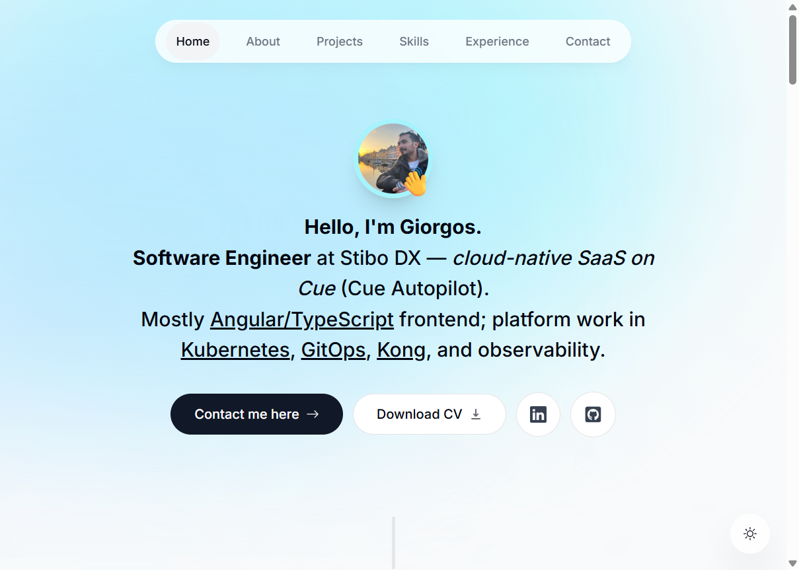

# Personal Portfolio

[](https://github.com/GeorgeNonis/white-themed-portfolio/actions/workflows/ci.yml)
[](https://giorgos-nonis.vercel.app)

Personal site for Giorgos Nonis — projects, experience, skills, contact.

**Live:** [giorgos-nonis.vercel.app](https://giorgos-nonis.vercel.app)



Built with React & Next.js (App Router), TypeScript, Tailwind CSS, Framer Motion, React Email & Resend.

## Dev

```bash
npm install
npm run dev    # http://localhost:3000
npm run build
npm run start  # production preview (use if dev EPERM on Windows)
```

See **`PROJECT_CONTEXT.md`** for content rules, UI/theme notes, and AI session context.

## Featured projects

- [Password Generator](https://chromewebstore.google.com/detail/password-generator/ciplnefaommlkglhkbabmpkckccimajp) — Chrome extension
- [Color Picker](https://chromewebstore.google.com/detail/color-picker-nonis/mpcmgnbiaijedofjkmphnalpoonggcbl) — Chrome extension

Screenshots live in `public/projects/`.
